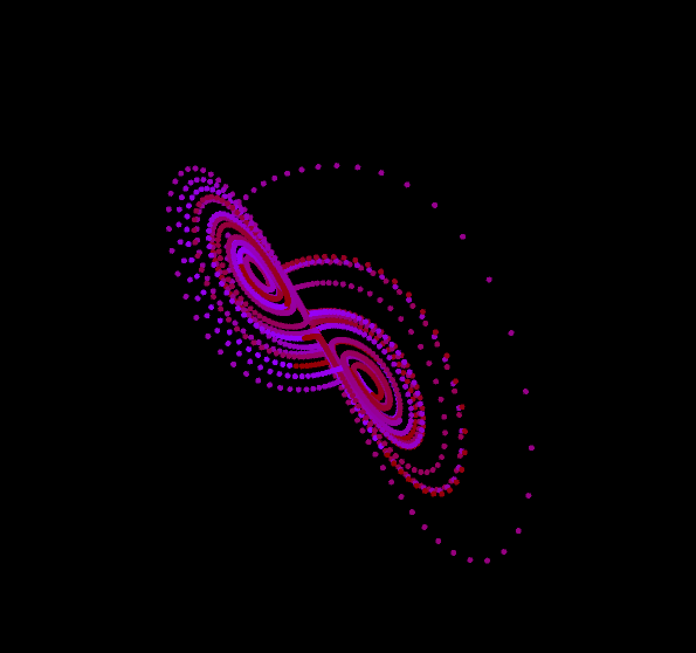

# Cellular Automata

## Table of Contents

- [About](#about)
- [Getting Started](#getting_started)
- [Usage](#usage)
- [Contributing](../CONTRIBUTING.md)

## About 

A cellular automaton is a collection of "colored" cells on a grid of specified shape that evolves through a number of discrete time steps according to a set of rules based on the states of neighboring cells. The rules are then applied iteratively for as many time steps as desired. 

## Lorrenz

### Running

A step by step series of examples that tell you how to get a development env running.

End with an example of getting some data out of the system or using it for a little demo.

## Usage 

Add notes about how to use the system.
